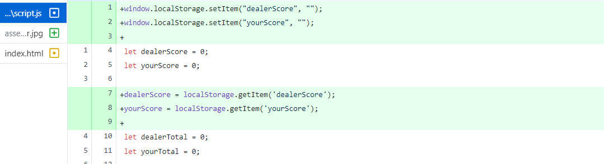
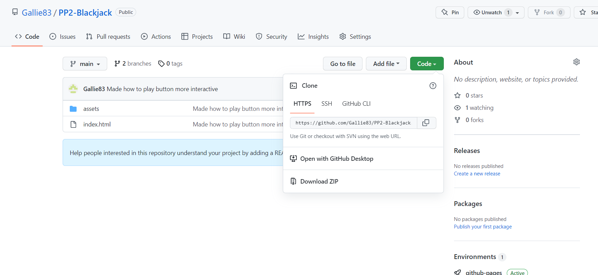

# **_BlackJack_**

BlackJack is a classic card game where the player and dealer both try to get as close to 21 as possible without exceeding it. It is a well known game played in casinos worldwide.

Welcome to the <a href="https://gallie83.github.io/PP2-Blackjack/" target="_blank" rel="noopener">BlackJack</a> Website.

# Contents

* [**User Experience UX**](<#user-experience-ux>)
    *  [User Stories](<#user-stories>)
    * [Design Choices](<#design-choices>)
    *  [Typography](<#typography>)
    *  [Colour Scheme](<#colour-scheme>)
* [**Features**](<#features>)
    * [**Existing Features**](<#existing-features>)
         * [How To Play](<#how-to-play>)
         * [Dealer Cards](<#dealer-cards>)
         * [Player Cards](<#player-cards>)
         * [Game Buttons](<#game-buttons>)
         * [Responsiveness](<#responsiveness>)
    * [**Future Features**](<#future-features>)
* [**Technologies Used**](<#technologies-used>)
* [**Debugging**](<#debugging>)
* [**Testing**](<#testing>)
* [**Deployment**](<#deployment>)
* [**Credits**](<#credits>)
    * [**Content**](<#content>)
    * [**Media**](<#media>)
*  [**Acknowledgements**](<#acknowledgements>)

# User Experience (UX)

## User Stories

* As a user I want to see clearly how the game is layed out.
* As a user I want to easily be able to see how the game is played.
* As a user I want to have all the game functions visible when the screen loads up.
* As a user I want to have access to the game on a variety of devices.
* As a user I want to have my progress through the game tracked.

[Back to top](<#contents>)
## Design Choices

 * ### Typography
      The font I chose for the body was 'Special Elite', which I found on <a href="https://fonts.google.com/" target="_blank" rel="noopener">Google Fonts</a>.
      I chose this font as it gave a gritty, old western feel to the website which fit into the aesthetic I was going for.

      

      For the heading of the website I went with the 'Great Vibes' font. The elegant look of this contrasted well with the more rugged look of 'Special Elite'.

      

 * ### Colour Scheme
      The colour scheme eventually chosen is mostly black. I chose a dark background as the cards are then left to be the main focal point of the website. I also have the win/lose message in red to stand out from the black background, it also matches the red back of the cards.

[Back to top](<#contents>)
# Features

The BlackJack website is designed to be simple and legible above all else.

## Existing Features  
  * ### How to Play

    * Located underneath the heading, there is a 'How to play button'.
    

    * When clicked, a paragraph explaining the rules appears, and dissapears on the second click.
    

[Back to top](<#contents>)

  * ### Dealer Cards

      * Below the How to play button are the dealers cards. One card remains face down until the round is over. If the player wins via blackjack or the five card rule, or goes bust however, then the dealers card does not turn over.
      

[Back to top](<#contents>)

  * ### Player Cards

      * Below the dealers cards are the players cards. Above the card images is a counter telling the player how much their hand is currently worth.

      

[Back to top](<#contents>)

  * ### Game Buttons

      * The players card are followed by the game buttons- 'Hit', 'Stand' and 'New Deal' which functions are explained in the 'How to Play' section.
      Underneath the game buttons are the score counters for how many round you have won vs the dealer.

      

  * ### Resonsiveness
      * The website is responsive accross all screen sizes. The cards and content scale down to allow it to retain its legibility on smaller screens. The website was tested on the following browsers with no visible issues for the user. Google Chrome, Microsoft Edge and Mozilla Firefox.

      * The responsive design tests were carried out manually with [Google Chrome DevTools](https://developer.chrome.com/docs/devtools/) and [Am I Responsive](https://ui.dev/amiresponsive/).

|        | Moto G4 | Galaxy S5 | iPhone 5 | iPad | Display <1200px | Display >1200px |
|--------|---------|-----------|----------|------|-----------------|-----------------|
| Render | pass    | pass      | pass     | pass | pass            | pass            |
| Images | pass    | pass      | pass     | pass | pass            | pass            |
| Links  | pass    | pass      | pass     | pass | pass            | pass            |

## Future Features 

* A betting system so that players would start with a certain amount of money and be able to bet as much as they want per hand.
* Players to be able to carry their score over after the browser window is closed.
* An online leaderboard so players could compare their scores to their friends.

[Back to top](<#contents>)

# Technologies Used
* [HTML5](https://html.spec.whatwg.org/) - provides the content and structure for the website.
* [CSS](https://www.w3.org/Style/CSS/Overview.en.html) - provides the styling.
* [Javascript](https://www.javascript.com/) - provides the logic for the website.
* [Gitpod](https://www.gitpod.io/#get-started) - used to deploy the website.
* [Github](https://github.com/) - used to host and edit the website.

[Back to top](<#contents>)

# Debugging

* While making this website I wanted players to be able to track their wins against the dealer after each round. I found the .localStorage() function which is supposed to keep information in the browser until the browser window is closed. However, the score counters would still return to zero after each round. 

* I then decided to have a 'New Deal' button, which would clear the table and reset all the variables apart from the score counters. This however, interfered with an event listener I had that was listening for a click on the hit button to add another card for the player. After every round another event listener would be added, meaning if it was the third round, one click would add 3 cards for the player and so on. I fixed this by using a function to set the event listener back to one after each round. 

# Testing

## HTML testing

## CSS testing

## Lighthouse testing

# Deployment

### **To deploy the project**
The site was deployed to GitHub pages. The steps to deploy a site are as follows:
  1. In the GitHub repository, navigate to the **Settings** tab.
  2. Once in Settings, navigate to the **Pages** tab on the left hand side.
  3. Under **Source**, select the branch to **master**, then click **save**.
  4. Once the master branch has been selected, the page will be automatically refreshed with a detailed ribbon display to indicate the successful deployment.

  The live link to the Github repository can be found here - https://gallie83.github.io/PP1-HTML-CSS/

### **To create a local clone of this project**
The method from cloning a project from GitHub is below:

1. Under the repository’s name, click on the **code** tab.
2. In the **Clone with HTTPS** section, click on the clipboard icon to copy the given URL.

3. In your IDE of choice, open **Git Bash**.
4. Change the current working directory to the location where you want the cloned directory to be made.
5. Type **git clone**, and then paste the URL copied from GitHub.
6. Press **enter** and the local clone will be created.

[Back to top](<#contents>)

# Credits
### Content

* The fonts came from [Google Fonts](https://fonts.google.com/).
* The inspiration for the How to play button came from [W3schools](https://www.w3schools.com/howto/howto_js_accordion.asp).
* All code, except where otherwise specified, was written by me - Kevin Gallagher

### Media
* The large sized background came from [Wallpaper Safari](https://cdn.wallpapersafari.com/56/28/6s0C7W.jpg).
* The small sized background came from [Wallpaper Cave](https://wallpapercave.com/wp/wp2940168.png).

[Back to top](<#contents>)

# Acknowledgements
The site was completed as a Portfolio 2 Project piece for the Full Stack Software Developer Diploma at the [Code Institute](https://codeinstitute.net/). As such I would like to thank my mentor [Precious Ijege](https://www.linkedin.com/in/precious-ijege-908a00168/), the Slack community, and all at the Code Institute for their help and support. I would also like to thank my friend Luke Walsh, for helping Javascript logic make sense to me.

Kevin Gallagher 2022.

[Back to top](<#contents>)